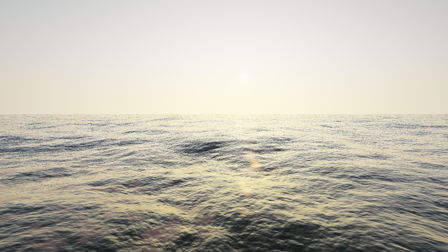

# Blue Meridian

A world sailing simulator for Android, in Java. **The ocean comes first** — if the
water is not convincing, nothing else matters.

Current state: **Phase 0 and Phase 1 are implemented.** There is a sea and a sky.
There is no boat yet.



---

## What actually works right now

| | |
|---|---|
| **Ocean** | Tessendorf FFT surface. JONSWAP wind sea with fetch relations + an independent Gaussian swell train, Mitsuyasu directional spreading, finite-depth dispersion. Three cascades (512 m / 128 m / 16 m) with non-overlapping wavenumber bands. |
| **Transform** | Cooley-Tukey inverse FFT on the GPU, driven by a butterfly table generated in `core`. Four packed complex signals per cascade give exact displacement, slopes and the folding Jacobian. |
| **Geometry** | Screen-space projected grid: one draw call, no LOD rings, no seams, overscan derived from the wave geometry. |
| **Shading** | Fresnel (IOR 1.333), analytic sky reflection, roughness from local slope, GGX sun specular, height-driven subsurface scattering, Jacobian foam broken up by Worley noise, Beer-Lambert attenuation. |
| **Sky** | Preetham, evaluated per pixel and reused for water reflections. Sky-driven auto-exposure. |
| **Post** | HDR half-float target, thresholded bloom, ACES tone mapping, manual sRGB encode. |
| **Physics surface** | `CpuOceanSurface` runs the same spectrum and butterfly schedule on the CPU at physics resolution, so a boat can float on the water that is drawn — and a server can replay it without a GPU. |
| **Build** | Gradle multi-module, desktop launcher, Android launcher, GitHub Actions producing an installable APK on every push. |

## Everything is free

No purchases, no season pass, no in-game currency, no advertising, no analytics
SDK. This is a deliberate design constraint, not a stage: it removes the entire
category of decisions where competitive integrity gets traded away piece by
piece, and it changes two technical choices —

- **Weather** comes from NOAA GFS and WaveWatch III, which are US public domain
  and free for any use. Open-Meteo is free for non-commercial use and stays as
  the development source, behind the same interface.
- **Infrastructure** is sized for free tiers: GitHub Actions on a public
  repository, GitHub Releases for distribution, GitHub Pages for the showcase.

## Getting it onto a phone

1. Open the repository's **Releases** page on the phone.
2. Download the `.apk` from the latest build.
3. Allow installation from that source when prompted, and open it.

The game runs natively at full quality. Nothing goes through a browser — the
GitHub Pages site under `docs/` is a showcase only.

## Running it on a desktop

```sh
./gradlew :desktop:run                      # interactive ocean
./gradlew :desktop:renderReferenceScenes    # write the six reference frames to PNG
./gradlew :desktop:verifyGpuFft             # check the GPU FFT against the CPU one
./gradlew :core:test :render:validateShaders
```

The desktop launcher exists so a shader change is visible in seconds instead of an
APK install. Its shaders are byte-for-byte the ones Android runs.

Controls: `WASD`/`RF` move, drag to look, `[` `]` wind, `,` `.` sun, `-` `=`
choppiness, `1`–`4` quality tier, `B` bloom, `P` print state.

## Layout

```
core/      Pure JVM. Spectra, FFT, dispersion, sky model, deterministic RNG.
           No libGDX, no Android — enforced by the checkCorePurity task.
render/    Shaders, FFT pipeline, projected grid, sky, post-processing.
desktop/   LWJGL3 launcher, reference-scene renderer, GPU verification tool.
android/   Android launcher. Built in CI; needs the SDK.
docs/      GitHub Pages showcase.
```

`core` compiles and runs on a plain JVM with no graphics stack. That is what lets
the authoritative server replay exactly the physics the client ran, and what makes
the wave spectrum unit-testable.

## How this is kept honest

An ocean renderer fails quietly. A transposed index or a conjugated twiddle still
produces something that moves and looks vaguely like water, so "it looks fine" is
not evidence. Four checks run on every push:

1. **`core` unit tests (30).** The FFT is checked against a naive DFT. The
   spectrum chain is checked for energy conservation: the wavenumber spectrum
   integrates back to the significant wave height it was built from, to within 3%.
   The sky model's coefficient tables are checked against physical expectations.
2. **Shader validation.** `glslangValidator` compiles every shader, with includes
   resolved exactly as the runtime resolves them.
3. **GPU vs CPU.** The same sea state is evolved on both, and the displacement
   fields are compared texel by texel. Current agreement: **0.7% of RMS**, which
   is 16-bit float storage precision.
4. **Reference scenes.** Six fixed sea states are rendered offscreen in CI on a
   software rasteriser and published as artifacts.

Four real bugs were caught this way while building it: a JONSWAP fetch relation
that produced a 6.5 m sea where physics allows 4 m, a butterfly table uploaded
transposed, a horizon search that failed whenever the camera sat below crest
height, and foam whose equilibrium coverage depended on the frame rate.

## Assumptions and known gaps

Written down rather than hidden.

**Preetham instead of Hosek-Wilkie.** The brief asks for Hosek-Wilkie with
Preetham as the fallback. Preetham is what is implemented. Hosek-Wilkie's radiance
is driven by a large fitted dataset published by its authors that has to be
imported from them — reproducing it from memory would be fabrication. Preetham's
coefficients are a small closed-form table that can be written down and verified,
and `PreethamSkyTest` does verify them.

Preetham has a real limitation that is handled explicitly: its zenith luminance
goes **negative** below roughly a 10° sun elevation. Below that limit the value at
the limit is carried down and faded exponentially, so twilight darkens smoothly
instead of inverting. Both behaviours are pinned by tests — including one that
asserts the raw model *does* go negative, so that nobody later "fixes" the
coefficients away from the published ones.

**The FFT runs as fragment passes, not compute.** The brief asks for a compute
shader with a fragment fallback. This is the fallback, implemented first
deliberately: it works on GLES 3.0, which is a meaningfully wider set of devices,
and its memory traffic is identical — the transform runs on one RGBA32F surface
carrying two packed complex signals, so a pass over four signals costs the same
reads and writes either way. What compute would save is the fixed-function
overhead of `2·log2(N)` draw calls per signal pair.

The specific blocker for compute is worth recording: libGDX exposes the entire
GLES 3.1 compute API (`glDispatchCompute`, `glBindImageTexture`, `glMemoryBarrier`
are all on `Gdx.gl31`) but **not** `glTexStorage2D`, and GLES 3.1 requires
immutable-format textures for image load/store. Adding the compute path therefore
needs a ~15-line per-platform bridge — `org.lwjgl.opengl.GL42.glTexStorage2D` on
desktop, `android.opengl.GLES30.glTexStorage2D` on Android — before any of it can
be written.

**Not yet verified on real hardware.** Everything above was developed and tested on
Mesa's `llvmpipe` software rasteriser under a virtual display. That proves
correctness — the GPU FFT matches the CPU reference numerically — but it says
nothing about frame rate. The 60 fps targets in the performance table are budgets,
not measurements. **The Phase 1 acceptance criterion of 60 fps on a target device
is not yet demonstrated**, and cannot be until the APK runs on a phone.

**Screenshot realism is not claimed.** The brief's acceptance test is that a still
frame passes for a photograph for two seconds. That is a judgement a person makes,
not one this repository can assert. The six reference frames are published so the
judgement can be made rather than asserted. My own read: the wave *shape* and the
crossed-sea structure hold up; the shading is still flatter than a photograph,
mostly for want of screen-space reflections and a sharper scattering term.

**Not started.** Everything from Phase 2 on: boat, sails, polars, weather service,
netcode, workshop. The module list in the brief includes `shared-protocol`,
`server-realtime`, `server-api`, `weather-service` and `tools` — those directories
do not exist yet, because empty modules are placeholders wearing a costume.

**Approximations, labelled.** The sun's colour is a two-term extinction fit, not a
spectral radiance model. Whitecap coverage is scaled by wind speed with a tuned
coefficient. The foam Jacobian threshold sits at the onset of compression rather
than at true folding, because true folding produces almost no foam at realistic
choppiness. Boat polars, when they arrive, will be derived from published
performance data for real classes and will be approximations — they will never be
presented as official.

**Undecided.** No licence file yet: "free to play" and "open source" are different
choices, and that one is yours to make.

## Where the ocean's parameters live

Sea state is one immutable object, `SeaState`, carrying wind, fetch, depth, swell,
choppiness and a seed. Both the renderer and the CPU physics surface build their
wave field from exactly that object, so what a player sees and what a server
replays cannot drift apart. Identical seeds give identical oceans; that is tested.
